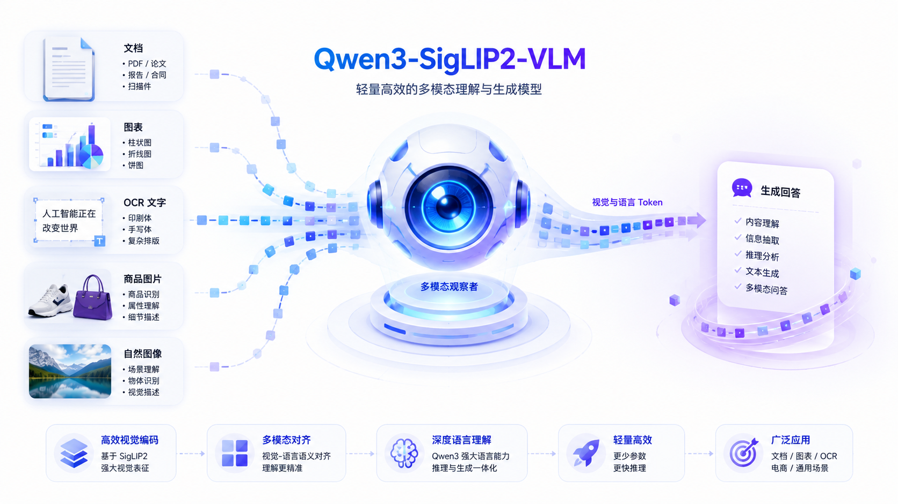
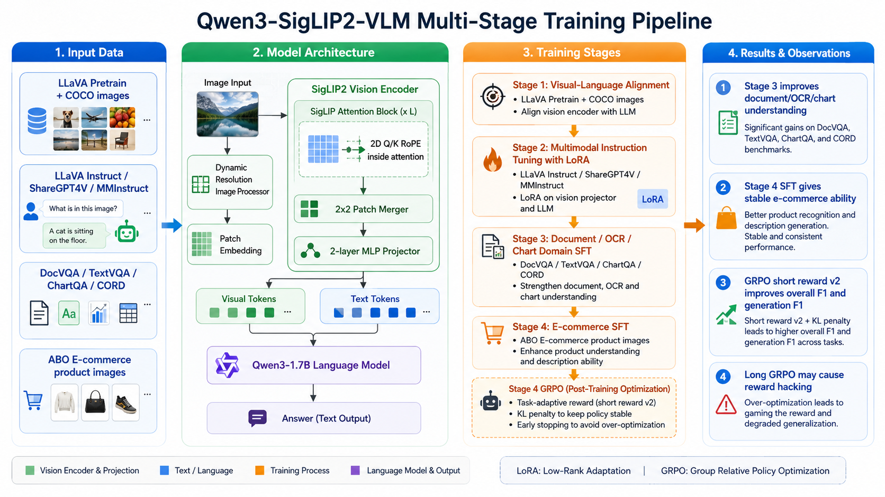
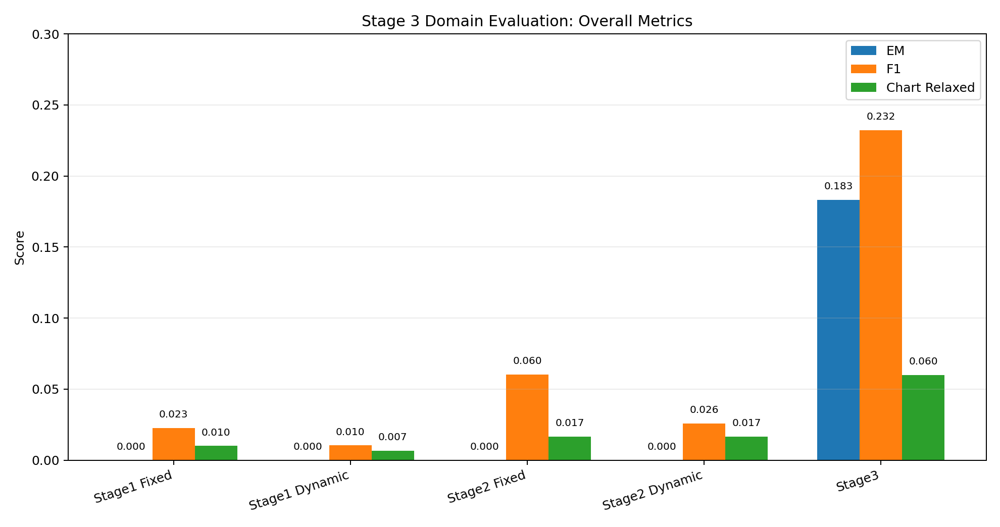
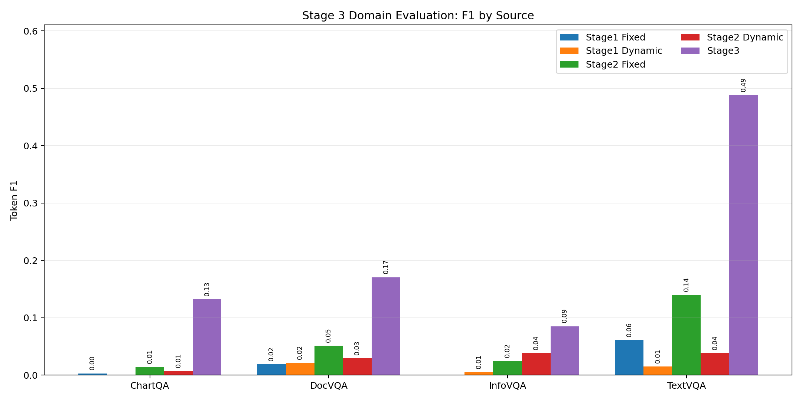
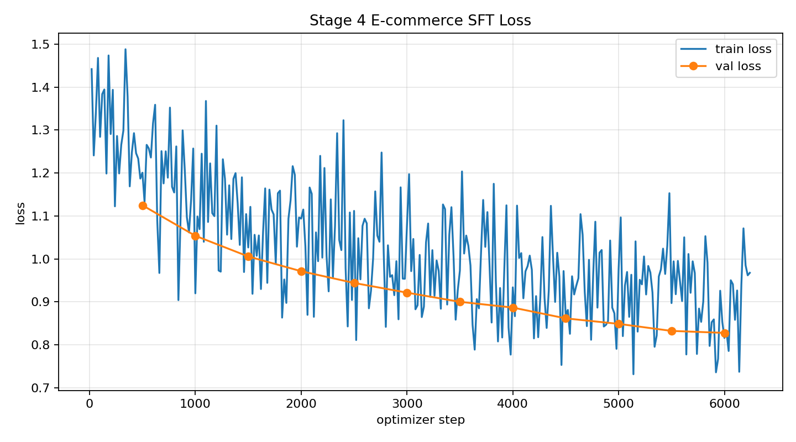
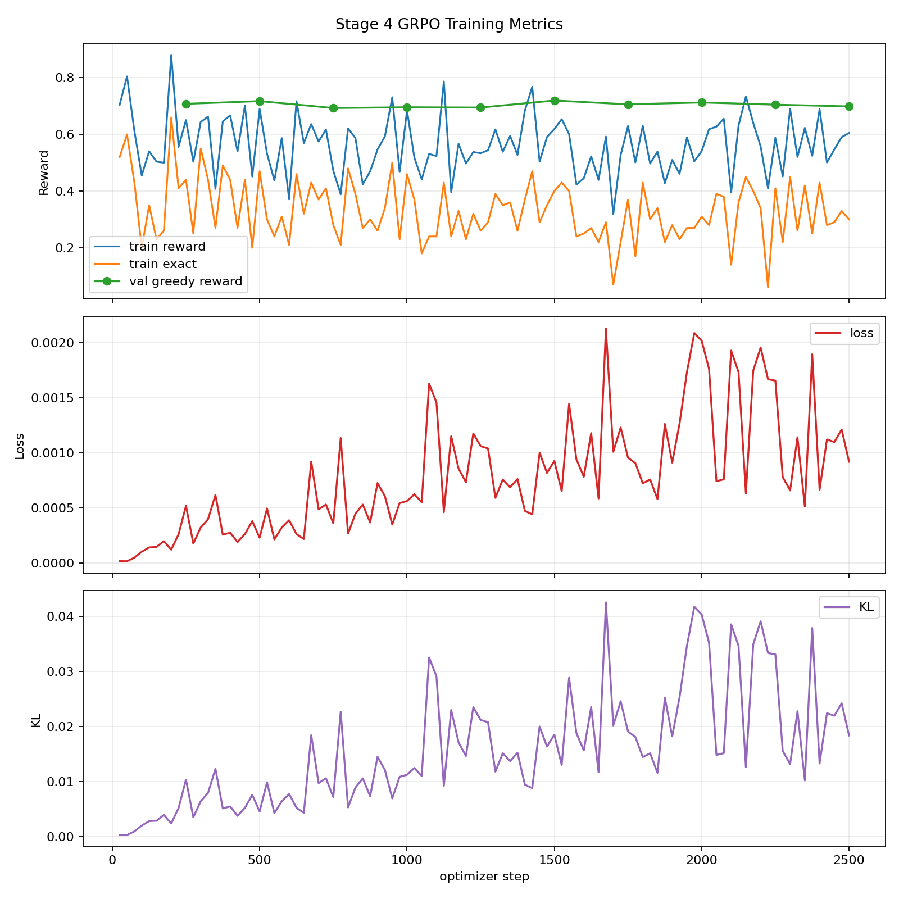
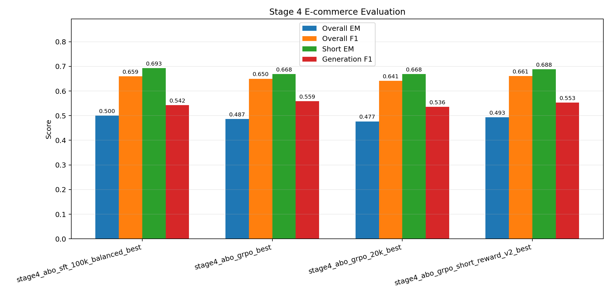
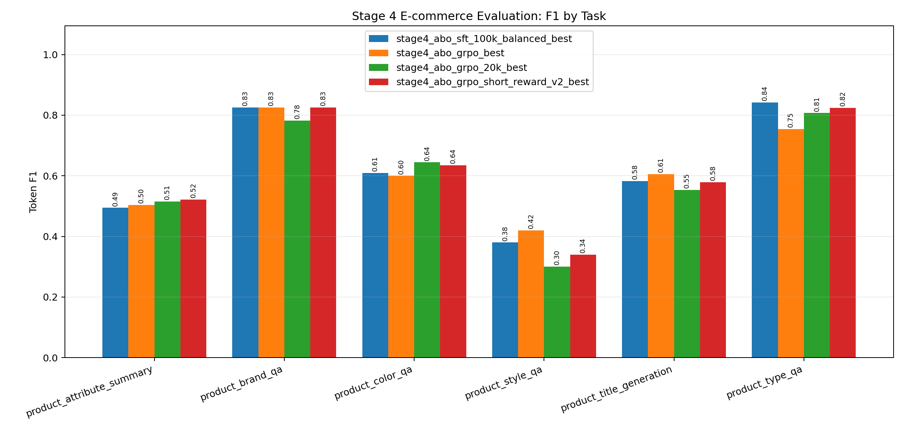

# Qwen3-SigLIP2-VLM

一个从零搭建的轻量级多模态大模型训练项目：以 **Qwen3-1.7B** 作为语言模型、**SigLIP2 SO400M** 作为视觉编码器，通过 Patch Merger + MLP Projector 完成视觉 token 到语言空间的对齐，并完整实现了从 Stage1 视觉语言对齐、Stage2 通用指令微调、Stage3 文档/OCR/图表垂域微调，到 Stage4 电商垂域 SFT + GRPO 的训练与评估流程。

这个项目的目标不是直接复刻一个大规模商业 VLM，而是把一个 VLM 从数据、模型、训练脚本、评估脚本到 GRPO ablation 的核心链路跑通。代码尽量保持脚本化、模块化和中文注释，适合学习、复现实验和作为多模态方向的工程项目展示。



## Highlights

- **Qwen3-1.7B + SigLIP2 SO400M 架构**：使用独立视觉编码器、2x2 Patch Merger 和两层 MLP Projector 拼接视觉/文本 token。
- **动态分辨率图像处理**：支持按图像长宽比选择 patch-aligned 分辨率，并在 batch 内 padding。
- **SigLIP2 内部 2D RoPE 实验**：将 2D visual RoPE 加到 SigLIP attention 的 Q/K 上，而不是简单在 projector 后拼位置编码。
- **四阶段训练流程**：Stage1 对齐、Stage2 instruction tuning、Stage3 文档/OCR/ChartQA 混合垂域、Stage4 ABO 电商垂域。
- **LoRA + GRPO 实验闭环**：实现在线 GRPO，包括 G 个回复采样、组内 advantage 标准化、KL penalty、early stopping 和任务自适应 reward。
- **可复现实验报告**：训练脚本会输出 metrics.csv 和 loss/reward 曲线；评估脚本会输出 markdown 报告和可视化图。

## Model Design

整体结构：

```text
image
  -> SigLIP2 Vision Encoder
  -> optional 2D Q/K RoPE inside SigLIP attention
  -> 2x2 Patch Merger
  -> 2-layer MLP Projector
  -> visual tokens

text prompt
  -> Qwen tokenizer
  -> text tokens

visual tokens + text tokens
  -> Qwen3-1.7B Causal LM
  -> answer
```

关键模块：

| Module | File | Description |
|---|---|---|
| Patch Merger | `src/vlm/models/patch_merger.py` | 将相邻 2x2 patch token 合并，降低视觉 token 数量 |
| Projector | `src/vlm/models/projector.py` | 两层 MLP，将 SigLIP hidden size 映射到 Qwen hidden size |
| VLM Model | `src/vlm/models/vlm_model.py` | 负责视觉编码、视觉 token 插入、语言模型 forward/generation |
| Dynamic Image Processor | `src/vlm/data/image_processing.py` | 动态分辨率、patch 对齐、batch padding |
| Collator | `src/vlm/data/collator.py` | 构造 input_ids、labels、pixel_values 和 image metadata |

## Training Pipeline

下图概括了本项目从输入数据、模型结构、四阶段训练到最终评估结论的完整流程：



### Stage 1: Visual-Language Alignment

目标是先让 projector 学会把视觉 token 对齐到 Qwen 的语言空间。训练时冻结大部分 backbone，主要训练 Patch Merger / Projector，并在后续实验中尝试解冻 SigLIP 最后几层。

数据：

- LLaVA-Pretrain 558K / LLaVA-CC3M-Pretrain
- COCO train2014 images

入口：

```bash
bash scripts/train_stage1.sh
```

### Stage 2: General Multimodal Instruction Tuning

目标是让模型学会多轮/单轮视觉问答格式，并通过 LoRA 调整 Qwen 语言模型。

数据：

- LLaVA-1.5 instruction data
- ShareGPT4V subset
- MMInstruct subset

入口：

```bash
bash scripts/train_stage2.sh
```

### Stage 3: Document / OCR / Chart Domain SFT

目标是增强文档理解、OCR、图表问答能力。这个阶段从 Stage2 LoRA checkpoint 初始化。

数据混合：

- DocVQA
- TextVQA
- ChartQA
- CORD
- FUNSD / SROIE style structured extraction data

入口：

```bash
bash scripts/train_stage3.sh
```

Stage3 在 300 样本快速评估上的提升非常明显：

| Checkpoint | EM | F1 | Chart Relaxed |
|---|---:|---:|---:|
| Stage1 fixed 50k | 0.0000 | 0.0226 | 0.0100 |
| Stage2 fixed 150k r32 | 0.0000 | 0.0602 | 0.0167 |
| Stage3 doc/ocr mix | **0.1833** | **0.2324** | **0.0600** |





### Stage 4: E-commerce Domain SFT

Stage4 使用 Amazon Berkeley Objects 相关数据构造电商商品图问答任务，包括品牌、颜色、类型、风格、标题生成和属性总结。

任务类型：

- `product_brand_qa`
- `product_color_qa`
- `product_type_qa`
- `product_style_qa`
- `product_title_generation`
- `product_attribute_summary`

入口：

```bash
bash scripts/train_stage4_sft.sh
```

100k balanced SFT 的验证 loss 稳定下降：



## GRPO Experiments

本项目实现了一个面向电商垂域的在线 GRPO 训练脚本：

```bash
bash scripts/train_stage4_grpo.sh
```

核心流程：

```text
1. 对每个 prompt 采样 G 个回复
2. 使用任务自适应 reward 计算每个回复的奖励 R_i
3. 在同一 prompt 的 G 个回复内部做标准化
   A_i = (R_i - mean(R)) / (std(R) + eps)
4. 对 advantage 做裁剪
5. 计算 policy logprob 与 reference logprob
6. 使用 clipped surrogate + KL penalty 更新 LoRA
```

我们做了三组 GRPO ablation：

| Run | Main Setting | Observation |
|---|---|---|
| GRPO 300-step | short-answer reward | generation F1 提升，但整体 EM/F1 下降 |
| GRPO 20k | long run, `NUM_GENERATIONS=4` | validation reward 变高，但真实评估整体退化，出现 reward hacking |
| GRPO short reward v2 | short run + stronger KL + early stopping + task-adaptive reward | 整体 F1 小幅超过 SFT，generation F1 明显优于 SFT |

GRPO short reward v2 使用：

- `KL_BETA=0.05`
- `LR=5e-6`
- `MAX_STEPS=3000`
- `NUM_GENERATIONS=4`
- early stopping
- title/summary 使用 token F1 主 reward
- style/title/summary 任务重采样

训练在 step 2500 early stopped，best 出现在 step 1500：

| Step | Val Reward |
|---:|---:|
| 250 | 0.7080 |
| 500 | 0.7174 |
| 1500 | **0.7196** |
| 2500 | 0.6988 |



## Evaluation

Stage4 电商 300 样本评估结果：

| Checkpoint | EM | F1 | Short EM | Generation F1 |
|---|---:|---:|---:|---:|
| Stage4 SFT 100k balanced | **0.5000** | 0.6593 | **0.6931** | 0.5422 |
| GRPO 300-step | 0.4867 | 0.6498 | 0.6683 | **0.5589** |
| GRPO 20k | 0.4767 | 0.6409 | 0.6683 | 0.5358 |
| GRPO short reward v2 | 0.4933 | **0.6609** | 0.6881 | 0.5528 |



按任务 F1：

| Task | SFT100k F1 | GRPO short v2 F1 | Change |
|---|---:|---:|---:|
| attribute summary | 0.4943 | **0.5216** | +0.0273 |
| brand QA | **0.8256** | **0.8256** | +0.0000 |
| color QA | 0.6091 | **0.6352** | +0.0261 |
| style QA | **0.3800** | 0.3400 | -0.0400 |
| title generation | **0.5830** | 0.5792 | -0.0038 |
| type QA | **0.8421** | 0.8246 | -0.0175 |



结论：

- 如果追求整体稳定性，Stage4 SFT 100k balanced 仍是最稳 checkpoint。
- 如果展示 GRPO 的有效性，short reward v2 是最有说服力的版本：它避免了 20k 长跑的退化，并将整体 F1 从 0.6593 提升到 0.6609，同时 generation F1 从 0.5422 提升到 0.5528。
- GRPO 仍然需要更细的 reward engineering，尤其是 `product_style_qa` 和 `product_title_generation`。

## Repository Structure

```text
qwen3_siglip2_vlm/
├── scripts/
│   ├── train_stage1.sh
│   ├── train_stage2.sh
│   ├── train_stage3.sh
│   ├── train_stage4_sft.sh
│   └── train_stage4_grpo.sh
├── src/vlm/
│   ├── data/
│   │   ├── image_processing.py
│   │   ├── collator.py
│   │   ├── llava_pretrain_dataset.py
│   │   ├── llava_instruct_dataset.py
│   │   ├── domain_mix_dataset.py
│   │   └── grpo_dataset.py
│   ├── models/
│   │   ├── patch_merger.py
│   │   ├── projector.py
│   │   └── vlm_model.py
│   ├── training/
│   │   ├── train_stage1.py
│   │   ├── train_stage2.py
│   │   ├── train_stage3.py
│   │   ├── train_stage4_sft.py
│   │   └── train_stage4_grpo.py
│   ├── eval/
│   │   ├── eval_stage3_domain.py
│   │   └── eval_stage4_ecommerce.py
│   └── inference/
│       ├── infer_stage1.py
│       └── infer_stage2.py
├── tools/
│   └── split_llava_pretrain.py
├── docs/assets/
├── requirements.txt
└── README.md
```

## 安装与环境

```bash
git clone https://github.com/men934/Qwen3-SigLIP2-VLM.git
cd Qwen3-SigLIP2-VLM

python -m venv .venv
source .venv/bin/activate
pip install -r requirements.txt
```

设置 `PYTHONPATH`，让 Python 能找到 `src/vlm` 下的项目代码：

```bash
export PYTHONPATH=$PWD/src:$PYTHONPATH
```

训练脚本默认假设模型、数据集和 checkpoint 位于 `/root/autodl-tmp` 下。如果你的路径不同，可以通过环境变量覆盖：

```bash
QWEN_PATH=/path/to/Qwen3-1.7B \
SIGLIP_PATH=/path/to/siglip2-so400m-patch14-384 \
OUTPUT_DIR=/path/to/checkpoints/stage1 \
bash scripts/train_stage1.sh
```

## 数据说明

仓库不包含数据集和模型权重，只保留代码、README 和实验图表。本文实验使用的数据如下：

| 阶段 | 数据 |
|---|---|
| Stage1 | LLaVA-Pretrain / LLaVA-CC3M-Pretrain + COCO train2014 |
| Stage2 | LLaVA-1.5 instruction data + ShareGPT4V/MMInstruct subsets |
| Stage3 | DocVQA, TextVQA, ChartQA, CORD/FUNSD/SROIE-style document data |
| Stage4 | Amazon Berkeley Objects derived e-commerce image-text tasks |

## 常用命令

Stage1 视觉语言对齐：

```bash
bash scripts/train_stage1.sh
```

Stage2 通用多模态指令微调：

```bash
bash scripts/train_stage2.sh
```

Stage3 文档 / OCR / 图表垂域微调：

```bash
bash scripts/train_stage3.sh
```

Stage4 电商垂域 SFT：

```bash
bash scripts/train_stage4_sft.sh
```

Stage4 电商垂域 GRPO：

```bash
bash scripts/train_stage4_grpo.sh
```

Stage4 电商垂域评估：

```bash
PYTHONPATH=src python -m vlm.eval.eval_stage4_ecommerce \
  --max-samples 300 \
  --checkpoints stage4_100k_balanced,stage4_grpo_short_v2 \
  --output-dir outputs/stage4_eval_300 \
  --max-new-tokens 64
```

## 说明与局限

- 这是一个偏学习和工程复现导向的 VLM 项目。代码更重视链路清晰、注释完整和实验可复现，而不是极致训练效率。
- 当前 GRPO 实现是在线单次更新版本。代码中用 `current_logps.detach()` 作为当前采样组的 old-policy 快照，因此它更接近 online GRPO，而不是多轮 replay 的 PPO。
- 动态分辨率 + SigLIP2 Q/K 2D RoPE 是一个有价值的架构实验，但在当前实验中并没有稳定超过固定分辨率分支。
- Stage4 GRPO short reward v2 提升了整体 F1、generation F1、属性总结和颜色问答，但 `product_style_qa` 和 `product_title_generation` 仍然受 reward 设计影响较大。
- 模型权重、原始数据集和 checkpoint 不放在 GitHub 中，避免仓库过大；相关路径通过环境变量传入。
